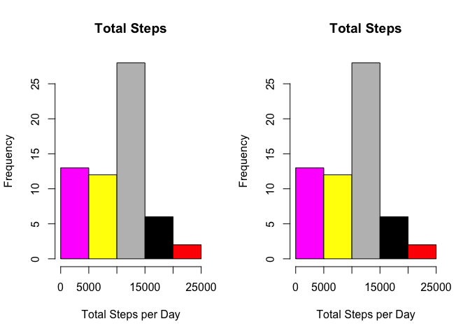
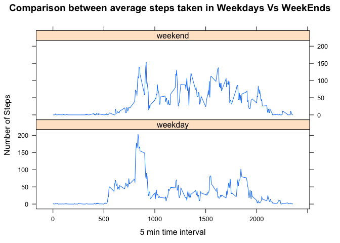

# Reproducible Research: Peer Assessment 1
Alberto A. Caeiro Jr  
## This project is part of the Data Science Specialization from Johns Hopkins University, offered by Coursera.

---
### Setting Working Folder

```r
setwd('/Users/acaeiro/Developer/Data Science Specialization/RepData_PeerAssessment1')
```

### Loading and preprocessing the data
The dataset is zipped, so we have to unzip it and then load into R.


```r
zipFile <- "./activity.zip"
fileList <- unzip(zipFile)
activity <- read.csv(fileList[1], sep=",", header=TRUE)
```

The date column needs to be reformatted to DATE format.

```r
activity$date <- as.Date(activity$date, format="%Y-%m-%d")
str(activity)
```

```
## 'data.frame':	17568 obs. of  3 variables:
##  $ steps   : int  NA NA NA NA NA NA NA NA NA NA ...
##  $ date    : Date, format: "2012-10-01" "2012-10-01" ...
##  $ interval: int  0 5 10 15 20 25 30 35 40 45 ...
```

## What is mean total number of steps taken per day?

1. Total numbers of steps taken Each Day (Hist)

```r
byValue=list(Date = activity$date)
SumOfSteps <- aggregate(activity$steps, by=byValue, FUN=sum, na.rm=TRUE)
names(SumOfSteps) <- c("Date", "Sum.Of.Steps")
with(SumOfSteps, hist(Sum.Of.Steps, col=Date, xlab="Total Steps per Day", main="Total Steps"))
```

 

2. Mean total number of steps

```r
byValue=list(Date = activity$date)
meanOfSteps <- aggregate(activity$steps, by=byValue, FUN=mean, na.rm=TRUE)
names(meanOfSteps) <- c("Date", "Average.Of.Steps")
with(meanOfSteps, plot(Date, Average.Of.Steps, ylab="Mean - Daily Total Steps", 
                       main="Average - Steps by Day"))
```

 

3. Median total number of steps

```r
byValue=list(Date = activity$date)
medianOfSteps <- aggregate(activity$steps, by=byValue, FUN=median, na.rm=TRUE)
names(medianOfSteps) <- c("Date", "Median.Of.Steps")
with(medianOfSteps, plot(Date, Median.Of.Steps, ylab="Median - Daily Total Steps", 
                               main="Median - Steps by Day"))
```

 

## What is the average daily activity pattern?
4. Make a time series plot (i.e. type = "l") of the 5-minute interval (x-axis) and the average number of steps taken, averaged across all days (y-axis)

```r
byValue=list(TimeInterval = activity$interval)
stepsByInterval <- aggregate(activity$steps, by=byValue, FUN=mean, na.rm=TRUE)
names(stepsByInterval) <- c("Interval", "Mean.Of.Steps")
with(stepsByInterval, plot(Interval, Mean.Of.Steps, type="l", xlab="5 Min Interval", ylab="Average Steps", 
                               main="Average Steps by 5 Min Interval"))
```

 

5. Which 5-minute interval, on average across all the days in the dataset, contains the maximum number of steps?

```r
t <- cbind(stepsByInterval$Mean.Of.Steps, stepsByInterval$Interval)
colnames(t) <- c("Mean Of Steps", "5 min Interval")
maxNumOfSteps <- max(t[,1])
intervalOfMaxSteps <- t[(t[,1] == maxNumOfSteps),][2]
print(intervalOfMaxSteps)
```

```
## 5 min Interval 
##            835
```

## Imputing missing values
6. Counting and Reporting the number of NA in the dataset

```r
sum(is.na(activity$steps))
```

```
## [1] 2304
```
and it represents in % of the sampling...

```r
mean(is.na(activity$steps))
```

```
## [1] 0.1311
```

7. The strategy for filling in missing values will be to use the mean of the day.
In case of the mean == NaN, 0 will be used instead.
In case of a missing value in the day (but with the mean =>0), the missing value will be replaced by the mean of the day.
Here you can find the mean of steps by day.

```r
print(meanOfSteps)
```

```
##          Date Average.Of.Steps
## 1  2012-10-01              NaN
## 2  2012-10-02           0.4375
## 3  2012-10-03          39.4167
## 4  2012-10-04          42.0694
## 5  2012-10-05          46.1597
## 6  2012-10-06          53.5417
## 7  2012-10-07          38.2465
## 8  2012-10-08              NaN
## 9  2012-10-09          44.4826
## 10 2012-10-10          34.3750
## 11 2012-10-11          35.7778
## 12 2012-10-12          60.3542
## 13 2012-10-13          43.1458
## 14 2012-10-14          52.4236
## 15 2012-10-15          35.2049
## 16 2012-10-16          52.3750
## 17 2012-10-17          46.7083
## 18 2012-10-18          34.9167
## 19 2012-10-19          41.0729
## 20 2012-10-20          36.0938
## 21 2012-10-21          30.6285
## 22 2012-10-22          46.7361
## 23 2012-10-23          30.9653
## 24 2012-10-24          29.0104
## 25 2012-10-25           8.6528
## 26 2012-10-26          23.5347
## 27 2012-10-27          35.1354
## 28 2012-10-28          39.7847
## 29 2012-10-29          17.4236
## 30 2012-10-30          34.0938
## 31 2012-10-31          53.5208
## 32 2012-11-01              NaN
## 33 2012-11-02          36.8056
## 34 2012-11-03          36.7049
## 35 2012-11-04              NaN
## 36 2012-11-05          36.2465
## 37 2012-11-06          28.9375
## 38 2012-11-07          44.7326
## 39 2012-11-08          11.1771
## 40 2012-11-09              NaN
## 41 2012-11-10              NaN
## 42 2012-11-11          43.7778
## 43 2012-11-12          37.3785
## 44 2012-11-13          25.4722
## 45 2012-11-14              NaN
## 46 2012-11-15           0.1424
## 47 2012-11-16          18.8924
## 48 2012-11-17          49.7882
## 49 2012-11-18          52.4653
## 50 2012-11-19          30.6979
## 51 2012-11-20          15.5278
## 52 2012-11-21          44.3993
## 53 2012-11-22          70.9271
## 54 2012-11-23          73.5903
## 55 2012-11-24          50.2708
## 56 2012-11-25          41.0903
## 57 2012-11-26          38.7569
## 58 2012-11-27          47.3819
## 59 2012-11-28          35.3576
## 60 2012-11-29          24.4688
## 61 2012-11-30              NaN
```

8. Create a new dataset that is equal to the original dataset but with the missing data filled in.
So with the strategy stated above we have:

```r
t <- activity
for (i in 1:length(meanOfSteps$Date)){
    if (is.nan(meanOfSteps$Average.Of.Steps[i])) t[t[,2]==meanOfSteps$Date[i],1] <- 0    
}
complDataset <- t 
```

Considering this new dataset, let's re-check itens 1, 2 and 3 to see what are the changes.

Looking at Total Steps.

```r
byValue=list(Date = complDataset$date)
SumOfStepsComplete <- aggregate(complDataset$steps, by=byValue, FUN=sum, na.rm=TRUE)
names(SumOfStepsComplete) <- c("Date", "Sum.Of.Steps")
with(SumOfStepsComplete, hist(Sum.Of.Steps, col=Date, xlab="Total Steps per Day", main="Total Steps"))
```

 

Average Steps

```r
byValue=list(Date = complDataset$date)
meanOfStepsComplete <- aggregate(complDataset$steps, by=byValue, FUN=mean, na.rm=TRUE)
names(meanOfStepsComplete) <- c("Date", "Average.Of.Steps")
with(meanOfStepsComplete, plot(Date, Average.Of.Steps, ylab="Mean - Daily Total Steps", 
                       main="Average - Steps by Day"))
```

 

Median

```r
byValue=list(Date = complDataset$date)
medianOfStepsComplete <- aggregate(complDataset$steps, by=byValue, FUN=median, na.rm=TRUE)
names(medianOfStepsComplete) <- c("Date", "Median.Of.Steps")
with(medianOfStepsComplete, plot(Date, Median.Of.Steps, ylab="Median - Daily Total Steps", 
                               main="Median - Steps by Day"))
```

 

# What happens when imputing missing values.
For better anwser this, we can see both graphs (on each metric - sum, mean, median) side by side.
Total Sum


```r
par(mfrow=c(1, 2))
with(SumOfSteps, hist(Sum.Of.Steps, col=Date, xlab="Total Steps per Day", main="Total Steps"))
with(SumOfStepsComplete, hist(Sum.Of.Steps, col=Date, xlab="Total Steps per Day", main="Total Steps"))
```

 

Mean

```r
par(mfrow=c(1, 2))
with(meanOfSteps, plot(Date, Average.Of.Steps, ylab="Mean - Daily Total Steps", 
                       main="Average - Steps by Day"))
with(meanOfStepsComplete, plot(Date, Average.Of.Steps, ylab="Mean - Daily Total Steps", 
                       main="Average - Steps by Day"))
```

 

Median

```r
par(mfrow=c(1, 2))
with(medianOfSteps, plot(Date, Median.Of.Steps, ylab="Median - Daily Total Steps", 
                               main="Median - Steps by Day"))
with(medianOfStepsComplete, plot(Date, Median.Of.Steps, ylab="Median - Daily Total Steps", 
                               main="Median - Steps by Day"))
```

 

As we can see that is no impact on the daily numbers. 

## Are there differences in activity patterns between weekdays and weekends?
Creating a new variable for holding info about weekdays/weekends.

```r
complDataset$weekday <- factor(weekdays(complDataset$date), levels=c("weekday", "weekend"))
for (i in 1:length(complDataset$date)){
    if (weekdays(complDataset$date[i]) %in% c("Saturday", "Sunday")) {
        complDataset$weekday[i] <- "weekend"
    } else {
        complDataset$weekday[i] <- "weekday"
    }
}
```
Checking if there are any difference in activity patterns between weekdays and weekends.
Make a panel plot containing a time series plot (i.e. type = "l") of the 5-minute interval (x-axis) and the average number of steps taken, averaged across all weekday days or weekend days (y-axis).


```r
complDatasetWeekDay <- subset(complDataset, weekday == "weekday", c(interval, steps))
byValue=list(TimeInterval = complDatasetWeekDay$interval)
avgStepsByIntervalWD <- aggregate(complDatasetWeekDay$steps, by=byValue, FUN=mean, na.rm=TRUE)
avgStepsByIntervalWD$weekday <- c("weekday")
complDatasetWeekEnd <- subset(complDataset, weekday == "weekend", c(interval, steps))
byValue=list(TimeInterval = complDatasetWeekEnd$interval)
avgStepsByIntervalWE <- aggregate(complDatasetWeekEnd$steps, by=byValue, FUN=mean, na.rm=TRUE)
avgStepsByIntervalWE$weekday <- c("weekend")
avgStepsGrouped <- rbind(avgStepsByIntervalWD, avgStepsByIntervalWE)

names(avgStepsGrouped) <- c("TimeInterval", "AvgSteps", "Weekdate")

library(lattice)
avgStepsGrouped <- transform(avgStepsGrouped, Weekdate = factor(Weekdate))
xyplot(AvgSteps ~ TimeInterval | Weekdate, data = avgStepsGrouped, type="l", layout=c(1,2), 
       ylab="Number of Steps", xlab="5 min time interval", 
       main="Comparison between average steps taken in Weekdays Vs WeekEnds")
```

 
